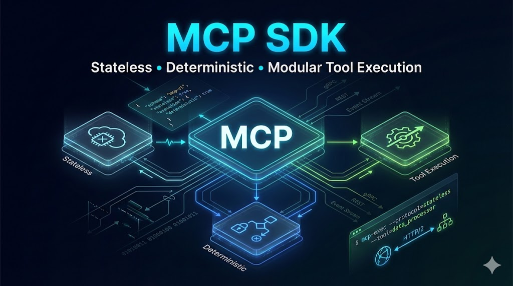

# MCP SDK — Model Context Protocol (Stateless)



## Overview

**MCP SDK** adalah SDK eksekusi *stateless* untuk menjalankan *tool* berbasis **Model Context Protocol (MCP)** secara deterministik, modular, dan terisolasi.

MCP SDK berfokus pada eksekusi protokol dengan batas arsitektur yang jelas dan eksplisit.

SDK ini dirancang untuk:

* dapat di-*embed* ke CLI, server HTTP, atau sistem berbasis STDIO
* beroperasi dengan aman di lingkungan sandbox atau multi-tenant
* mudah diuji dan dianalisis perilakunya
* memungkinkan penggantian provider (LLM, image, audio) tanpa mengubah core logic

---

## Problem Statement

Pada banyak sistem AI, penanganan protokol, logika bisnis, dan I/O sering tercampur. Hal ini menyebabkan:

* state tersembunyi atau implisit
* sulit diuji
* ketergantungan vendor (*vendor lock-in*)
* penanganan error yang tidak konsisten

MCP SDK memaksakan pemisahan tanggung jawab yang ketat:

```
Protocol → Core Logic → Providers → External
```

Setiap layer memiliki satu tanggung jawab dan tidak boleh melewati batas layer lain.

---

## Prinsip Arsitektur

### Stateless by Design

* Tidak ada session
* Tidak ada penyimpanan memori
* Tidak ada cache global
* Setiap request diproses secara independen

### Pure Core, Imperative Shell

* `protocol/` — kontrak request/response dan validasi
* `core/` — dispatcher dan eksekusi tool yang murni dan deterministik
* `providers/` — adapter ke sistem eksternal (network, IO)
* `shell/` — lingkungan eksekusi (CLI, HTTP, STDIO)

### Dependency Satu Arah

```
shell → core → protocol
       ↘ providers
```

Dependency tidak pernah mengalir ke atas.

---

## Struktur Proyek

```
mcp_sdk/
├─ protocol/     # MCPRequest, MCPResponse, schema, errors
├─ core/         # Stateless dispatcher dan tools
├─ providers/    # Adapter eksternal (LLM, image, audio)
├─ shell/        # Runner CLI / HTTP / STDIO
├─ utils/        # Utilitas JSON dan logging
└─ README.md
```

---

## Alur Eksekusi

1. Input diterima (CLI, HTTP, atau STDIO)
2. Input diparse menjadi `MCPRequest`
3. Request divalidasi oleh schema protokol
4. Dispatcher meroute request ke tool
5. Tool dieksekusi secara deterministik
6. Provider dipanggil jika membutuhkan akses eksternal
7. Output dibungkus menjadi `MCPResponse`

---

## Contoh Penggunaan

### Python API

Kode testing yang disediakan menunjukkan cara memanggil **Text, Image, dan Audio (STT)** secara programatik.

```python
from shell.composition import build_dispatcher
from protocol.request import MCPRequest

dispatcher = build_dispatcher()

# Text generation
request_text = MCPRequest.from_dict({
    "tool": "ai",
    "input": {"prompt": "Apa itu pure function?"},
    "ai": {"provider": "pollinations", "type": "text"}
})
response_text = dispatcher.dispatch(request_text)
if response_text.success:
    print(response_text.data)

# Image generation
request_image = MCPRequest.from_dict({
    "tool": "ai",
    "input": {"prompt": "A cat and a dog sitting on a couch"},
    "ai": {"provider": "pollinations_image", "type": "image"}
})
response_image = dispatcher.dispatch(request_image)
if response_image.success:
    image = response_image.data.get("image")
    image.show()

# Speech-to-text (file must exist)
request_stt = MCPRequest.from_dict({
    "tool": "ai",
    "input": {"file_path": "my_audio.mp3"},
    "ai": {"provider": "pollinations_stt", "type": "audio"}
})
response_stt = dispatcher.dispatch(request_stt)
if response_stt.success:
    print(response_stt.data.get("text"))
```

> ⚠️ Untuk STT, MCP **mengharuskan file audio sudah tersedia**. Jika file tidak ada, dispatcher akan mengembalikan error `INTERNAL_ERROR`.

---

### CLI

MCP SDK dapat dijalankan langsung dari CLI menggunakan input JSON:

```bash
echo '{"tool":"generate","input":{"prompt":"Hello world"},"ai":{"provider":"pollinations","type":"text"}}' | mcp-cli
```

Response:

```json
{"success":true,"data":{"text":"Hello world"}}
```

CLI mendukung semua jenis provider (text, image, audio) dan memanfaatkan dispatcher yang sama seperti Python API.

---

### HTTP

MCP SDK dapat di-*embed* di server HTTP untuk menerima request JSON:

```python
from fastapi import FastAPI, Request
from shell.composition import build_dispatcher
from protocol.request import MCPRequest

app = FastAPI()
dispatcher = build_dispatcher()

@app.post("/mcp")
async def mcp_endpoint(req: Request):
    payload = await req.json()
    request_obj = MCPRequest.from_dict(payload)
    response = dispatcher.dispatch(request_obj)
    return response.to_dict()
```

* Mendukung text, image, dan audio.
* Output selalu dalam format MCPResponse JSON.

---

### STDIO

MCP SDK mendukung mode *interactive* atau piping via STDIO. Contoh:

```bash
cat request.json | python -m mcp_sdk.shell.stdio
```

* STDIO membaca satu request per line.
* Response dikirim ke stdout per request.
* Logging internal dicetak ke stderr untuk debugging.

---

## Providers

Providers berperan sebagai adapter ke sistem eksternal, seperti:

* Large Language Models (LLM)
* Layanan generasi gambar
* API audio atau speech

Karakteristik provider:

* boleh asynchronous
* boleh melakukan operasi network atau IO
* tidak bergantung pada tipe MCP

Aturan dan kontrak provider didokumentasikan di `providers/README.md`.

---

## Requirements

* Python 3.10
* Pemahaman batas async dan sync
* Penerimaan terhadap batasan eksekusi stateless

SDK ini **tidak ditujukan** untuk:

* sistem dengan conversational memory
* workflow jangka panjang
* manajemen state implisit atau tersembunyi

---

## Kontribusi

### Aturan Kontribusi

Pull request dapat ditolak jika:

* menambahkan state global atau persisten
* menggabungkan provider ke layer core atau protocol
* mengekspos `MCPRequest` atau `MCPResponse` ke provider
* mengonfigurasi logging global (`logging.basicConfig`)
* membocorkan dependency berat ke core

### Format Commit

```
<type>: <scope> <deskripsi singkat>
```

Contoh:

* `feat(core): add generate tool`
* `refactor(protocol): tighten schema validation`
* `fix(provider-pollinations): handle timeout`

### Pedoman Kontribusi

* Perubahan harus fokus dan minimal
* Sertakan test jika relevan
* Satu tujuan per pull request

Jika maksud arsitektur belum jelas, disarankan membuka diskusi sebelum mengirimkan kode.

---

## Filosofi Desain

MCP SDK memprioritaskan kebenaran, batas yang eksplisit, dan maintainability jangka panjang dibandingkan kenyamanan atau abstraksi berlebihan.

> ⚠️ **Catatan Penting**: Untuk audio/STT, MCP **tidak membuat file audio otomatis**. File harus disediakan oleh pengguna. MCP hanya memproses file yang ada, sehingga perilaku STT deterministik dan stateless.
